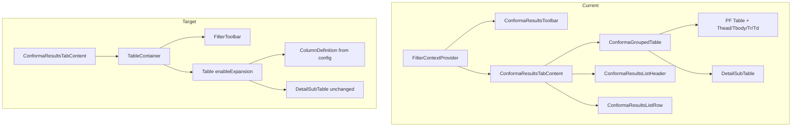

# Conforma Violations Board -- TableV2 Migration

## Scope

Migrate `src/components/Conforma/ConformaResultsTab/` from hand-rolled PF Table + legacy `FilterContext` to `TableV2` + the new filter system. The detail sub-table inside expanded rows stays as-is (compact read-only table, no benefit from TableV2).

## Architecture



## Part 1 -- Extend TableV2 with controlled expansion (~5 lines)

Add optional `expanded` / `onExpandedChange` props to `Table` and `useTable` so consumers can drive expansion from outside. Fully backward-compatible -- when omitted, TanStack manages expansion internally (current behavior).

**Files:**
- [src/shared/components/TableV2/hooks/useTable.ts](src/shared/components/TableV2/hooks/useTable.ts) -- accept optional `expanded` + `onExpandedChange` in `UseTableOptions`, pass to `useReactTable` state
- [src/shared/components/TableV2/types.ts](src/shared/components/TableV2/types.ts) -- add `expanded` / `onExpandedChange` to `TableProps`
- [src/shared/components/TableV2/Table.tsx](src/shared/components/TableV2/Table.tsx) -- destructure and forward new props to `useTable`
- [src/shared/components/TableV2/index.ts](src/shared/components/TableV2/index.ts) -- re-export `ExpandedState` type from TanStack for consumers

Key code change in `useTable.ts`:

```typescript
import { type ExpandedState, type OnChangeFn } from '@tanstack/react-table';

// In UseTableOptions:
expanded?: ExpandedState;
onExpandedChange?: OnChangeFn<ExpandedState>;

// In useReactTable config:
...(enableExpansion ? {
  getExpandedRowModel: getExpandedRowModel(),
  getRowCanExpand: () => true,
  ...(options.expanded !== undefined ? { state: { ...state, expanded: options.expanded } } : {}),
  ...(options.onExpandedChange ? { onExpandedChange: options.onExpandedChange } : {}),
} : {}),
```

## Part 2 -- Create `conforma-table-config.tsx`

New file: [src/components/Conforma/ConformaResultsTab/conforma-table-config.tsx](src/components/Conforma/ConformaResultsTab/conforma-table-config.tsx)

Contains:
- `CONFORMA_GROUPED_COLUMNS: ColumnDefinition<GroupedConformaRow>[]` with 4 columns (groupKey, violations, warnings, successes). Cell renderers use `ConformaCountBadge` inline.
- `filterConfigs` using `defineFilters<ConformaResultRow>()` -- replaces `FilterContext` usage:
  - `search` filter on `name` (matches rule code/title/component)
  - `multiSelect` filter on `status`

## Part 3 -- Rewrite `ConformaGroupedTable.tsx`

Replace raw PF Table with TableV2's `Table` component:
- `data={groups}` with `ColumnDefinition<GroupedConformaRow>[]`
- `enableExpansion` + `expandedContent={(group) => <DetailSubTable rows={group.rows} />}`
- Accept `expanded`/`onExpandedChange` from parent for expand-all control
- `getRowId={(g) => g.groupKey}`
- The `DetailSubTable` stays as-is (inner compact table, no migration needed)

**Deletes:**
- [src/components/Conforma/ConformaResultsTab/ConformaResultsListHeader.ts](src/components/Conforma/ConformaResultsTab/ConformaResultsListHeader.ts) -- replaced by `ColumnDefinition`
- [src/components/Conforma/ConformaResultsTab/ConformaResultsListRow.tsx](src/components/Conforma/ConformaResultsTab/ConformaResultsListRow.tsx) -- replaced by `cell` renderers

## Part 4 -- Rewrite `ConformaResultsToolbar.tsx`

Replace `BaseTextFilterToolbar` + `FilterContext` with the new `FilterToolbar`:
- `FilterToolbar` renders search + status filters automatically from `filterConfigs`
- Group-by dropdown, Expand-all button, and Show-duplicates switch become children of `FilterToolbar`
- Remove all `FilterContext` imports

## Part 5 -- Rewrite `ConformaResultsTab.tsx`

- Remove `FilterContextProvider` wrapper
- Use `useFilterState(filterConfigs)` + `useFilteredData(filterConfigs, ...)` for filtering
- Use `TableContainer` for loading/empty state machine
- Manage expansion state with `useState<ExpandedState>({})` and derive `allExpanded` from it
- Pass `expanded`/`onExpandedChange` to `Table` via the rewritten `ConformaGroupedTable`
- Group-by and show-duplicates logic stays in this component (it transforms the data before passing to table)

## Part 6 -- Update tests

- **`ConformaResultsTab.spec.tsx`** -- remove `FilterContext`-related mocking, update filter interactions to match new `FilterToolbar` behavior
- **`ConformaGroupedTable.spec.tsx`** -- update to match new component API (TableV2 renders slightly different DOM structure for expand toggles)
- **`ConformaResultsToolbar.spec.tsx`** -- update or simplify to match `FilterToolbar` wrapper

Test files for deleted files (`ConformaResultsListHeader`, `ConformaResultsListRow`) are removed, but their test coverage is absorbed by `ConformaGroupedTable.spec.tsx` since the cell renderers now live in column definitions.

## Part 7 -- Cleanup

- Delete [ConformaResultsListHeader.ts](src/components/Conforma/ConformaResultsTab/ConformaResultsListHeader.ts)
- Delete [ConformaResultsListRow.tsx](src/components/Conforma/ConformaResultsTab/ConformaResultsListRow.tsx)
- Remove legacy imports: `TableData` from `~/shared`, `createTableHeaders` from `~/shared/components/table/utils`, `ComponentProps` from `~/shared/components/table/Table`
- Run `yarn lint`, `yarn lint:restricted-imports`, `yarn type-checks`, `yarn test`

## What stays unchanged

- `conforma-grouping-utils.ts` -- pure data logic, no UI coupling
- `conforma-fetchers.ts` -- data fetching, untouched
- `useApplicationConformaResults.ts` -- hook, untouched
- `ConformaSummaryBar.tsx` -- summary bar above the table, untouched
- `ConformaCountBadge.tsx` -- used in column cell renderers, untouched
- `DetailSubTable` (in `ConformaGroupedTable.tsx`) -- compact inner table, no benefit from TableV2
- `ConformaResultsTab.scss` -- minimal styles, kept as-is
